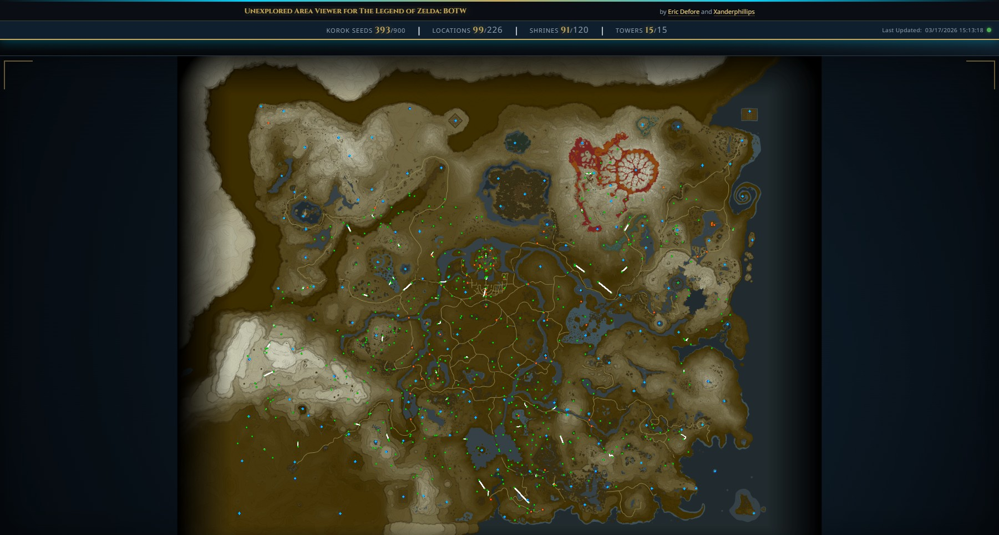

# The Legend of Zelda: BOTW Live Savegame Monitor

### Because there _really_ needed to be 900 of them, right?

A browser-based interactive map overlay for *The Legend of Zelda: Breath of the Wild* (Cemu emulator). It reads your Cemu save files directly — no mods, no plugins — and renders your completion progress on a pannable, zoomable map in real time. Korok seeds, locations, shrines, towers, divine beasts, and your current player position are all shown as color-coded icons that update automatically whenever you save in-game (manual or auto-save). Runs as a Docker container on the same machine as Cemu and is accessible from any browser on your local network.

### Map Stats
Each entry is color-coded, hoverable, and toggleable:

| Metric | Color | Total |
|--------|-------|-------|
| Korok seeds | Gold | 900 |
| Locations | Orange | 226 |
| Locations (Visited) | Teal | — |
| Shrines Discovered | Cyan | 120 |
| Shrines Completed | Yellow | 120 |
| Towers | Violet | 15 |
| Divine Beasts | Red | 4 |
| Player Position | White | — |

Each metric row shows the stat label on the left and its count on the right, with a color bar below. All UI state (visible categories, service filters, track player, zoom level, dismissed waypoints, map view) is persisted server-side and restored on every page load.

- **Hover** over a metric to highlight all matching icons on the map with a glowing ring
- **Click** a metric to show/hide that icon type on the map; hidden categories appear dimmed in the sidebar and the state persists across browser sessions
- **Locations (Visited)** shows a teal icon at each named location you have already discovered. Icons are type-specific — stables, villages, labs, the castle, shops, and generic checkpoints each use a distinct map icon sourced from [zeldamods/objmap](https://github.com/zeldamods/objmap). Undiscovered locations appear as orange dots.

### Services

A **Services** section in the sidebar lists nine location subtypes that can be toggled independently: Stable, Village, Settlement, Great Fairy, Goddess Statue, Inn, General Store, Armor Shop, and Jewelry Shop. Each toggle shows or hides that icon type on the map and persists its state across browser sessions. Services are a sub-filter of Locations (Visited) — only discovered locations of the selected types are shown.
- **Player Position** places a glowing white marker on the map at your character's last saved location. When the save was made inside a shrine, the marker appears at the shrine's overworld entrance rather than its local interior coordinates (detected via the MAP save flag)

### Track Player

A **Track Player** toggle sits below the Player Position row. When enabled (green), the map smoothly pans and zooms to the player's position whenever the save file is updated — keeping your character in view after each manual or auto-save. When disabled (red), the map stays at whatever location and zoom level you set. A slider beneath the toggle controls the zoom level used when tracking; the value persists between sessions. The track player toggle and zoom level are also controllable via the state API.

### Player Stats
Reads directly from the save files — no game interaction required:

| Stat | Notes |
|------|-------|
| Hearts | Max heart containers |
| Stamina | Max stamina wheels (1.0–3.0 in 0.2 increments) |
| Playtime | Total time played (H:MM:SS) |
| Rupees | Current rupee count |
| Motorcycle | Green = Master Cycle owned, Red = not yet |

### Map Labels

Region names are rendered as text overlays directly on the map and appear at zoom-appropriate levels:

- **Zoomed out** — 15 main tower regions (Hebra, Akkala, Lanayru, etc.) in large uppercase text
- **Medium zoom** — 8 broad named regions (Central Hyrule, Necluda, Faron, etc.)
- **Zoomed in** — 23 sub-regions and areas (Hyrule Field, Eldin Mountains, Gerudo Desert, etc.), with further fine-grained place names appearing at higher zoom levels

Labels scale inversely with zoom so they remain a consistent size on screen. Coordinate and name data sourced from [zeldamods/objmap](https://github.com/zeldamods/objmap) and [zeldamods/radar](https://github.com/zeldamods/radar).

### Map Icons

Hovering over any map icon shows a floating label offset to the side of the pin. Labels are zoom-aware — they scale up when zoomed out to stay readable, and maintain a consistent gap from the pin at all zoom levels. Labels use a semi-transparent dark style so the map remains visible behind them. When the player is inside a shrine, the player marker label reads **Player (In Shrine)**.

Scrolling the mouse wheel shows a brief zoom percentage indicator in the bottom-right corner of the map.

A server status indicator and save timestamp at the bottom of the sidebar show server reachability and when your save was last read.

### Live Data API

The viewer exposes a JSON endpoint that serves as a live data feed of your current save state:

```
GET http://localhost:3000/api
```

Since the server polls the save files for changes every 10 seconds, this endpoint always reflects your most recent save — manual or auto-save — no game modification or plugin required. External systems can poll `/api` on any interval to react to changes in game state.

```json
{
  "console": "XX",
  "KOROK_SEED_COUNTER": XX,
  "MAX_HEARTS": XX,
  "MAX_HEARTS_display": XX,
  "MAX_STAMINA": XX,
  "MAX_STAMINA_display": XX,
  "PLAYTIME": XX,
  "PLAYTIME_formatted": "XX:XX:XX",
  "RUPEES": XX,
  "MOTORCYCLE": XX,
  "PLAYER_POSITION": { "x": XX, "y": XX, "z": XX, "raw_hex": "XX" },
  "MAP": XX,
  "MAPTYPE": XX,
  "locations":          { "found": XX, "total": 226 },
  "shrines_discovered": { "found": XX, "total": 120 },
  "shrines_completed":  { "found": XX, "total": 120 },
  "towers":             { "found": XX, "total": 15 },
  "divine_beasts":      { "found": XX, "total": 4 },
  "koroks_discovered":  { "found": XX, "total": 900 }
}
```

The save-file data can serve as a live input feed for a wide range of external systems:

- **Stream overlays** — display live completion stats or player coordinates in OBS or browser-source overlays
- **Discord bots** — post milestone notifications when a Korok seed count or shrine count crosses a threshold
- **Home automation** — trigger lighting scenes or alerts based on game progress
- **Spreadsheets / logging** — poll on a cron schedule and append rows to track progress over a play session
- **Webhooks and pipelines** — feed into any HTTP-based automation tool (Zapier, n8n, Home Assistant, etc.)

### State API

Every piece of UI state can be read and written via a REST API. This lets external tools, scripts, or overlays control the viewer programmatically — the browser UI is just one client.

#### Bootstrap

```
GET /api/state         → { ok, state }   read full state
PUT /api/state   { … } → { ok, state }   replace full state
```

#### Map View

```
PATCH /api/state/map-view   { scale, panX, panY }   (null resets to default)
```

#### Track Player

```
PATCH /api/state/track-player   { enabled: true|false }
PATCH /api/state/track-zoom     { zoom: 5–90 }
```

#### Icon Visibility

```
PATCH /api/state/hidden-types     { type, hidden: true|false }
PATCH /api/state/hidden-services  { service, hidden: true|false }
```

Valid `type` values: `korok`, `location`, `location-discovered`, `shrine`, `shrine-completed`, `tower`, `divine-beast`, `labo`, `warp`, `player-position`

Valid `service` values: `hatago`, `village`, `settlement`, `great_fairy`, `goddess`, `yadoya`, `shop_yorozu`, `shop_bougu`, `shop_jewel`

#### Dismissed Waypoints

```
POST   /api/state/dismissed      { type: "korok"|"location", name }   dismiss one
DELETE /api/state/dismissed      { type: "korok"|"location", name }   restore one
DELETE /api/state/dismissed/all                                        restore all
```

#### Test Runner

```
POST /api/test/run
```

Triggers the server-side UI test suite. The server animates all API-controllable state in five phases — sidebar toggles, map stat sweeps, player stat sweeps, last-update timestamp and status light, player tracking and quadrant moves — broadcasting each change via SSE so the browser reflects every step in real time. Returns `{ ok, results }` when complete and automatically restores all state to pre-test values.

#### Real-time Updates (SSE)

```
GET /api/events
```

The browser subscribes to this Server-Sent Events stream. Any API write immediately pushes a `state-change` event to all connected browsers, so the UI reflects changes without waiting for the 10-second poll cycle. A `reload-save` event triggers the browser to re-fetch and re-parse the save file, used after the test runner completes to restore live save data.

#### Audio Feedback

The browser plays a short oscillator tone whenever key state changes arrive via SSE — distinct pitches for map stat changes, player stat changes, sidebar items being shown or hidden, and last-update/status changes. Tones are generated entirely via the Web Audio API (no audio files). During test runs the envelope is shortened to a staccato click so rapid sweeps don't produce overlapping sounds.



Thank you @marcrobledo for the [save game editors](https://github.com/marcrobledo/savegame-editors) much of this code is based on, and @MrCheeze for their [waypoint map](https://github.com/MrCheeze/botw-waypoint-map) which I modified to get the map markers I needed, as well as their [datamining research](https://github.com/MrCheeze/botw-tools). Map icons sourced from [zeldamods/objmap](https://github.com/zeldamods/objmap). Region label coordinates and English place names sourced from [zeldamods/objmap](https://github.com/zeldamods/objmap) and [zeldamods/radar](https://github.com/zeldamods/radar). Original extension work by Eric Defore, on whose foundation this project was built.

## Docker Setup

This application runs as a Docker container that automatically reads your Cemu save files and monitors them for changes, refreshing the map whenever you save in-game.

### Requirements

- Docker and Docker Compose running on the same machine as your Cemu save files (or with network access to them)

### Setup

1. Create a `server/.env` file to configure your Cemu save folder path.

   **If running Docker from WSL (Linux-style path):**
   ```
   SAVE_PATH=/mnt/c/Users/YourWindowsUsername/AppData/Roaming/Cemu/mlc01/usr/save/00050000/101c9400/user/80000001
   ```

   **If running Docker from Windows (Command Prompt or PowerShell):**
   ```
   SAVE_PATH=C:/Users/YourWindowsUsername/AppData/Roaming/Cemu/mlc01/usr/save/00050000/101c9400/user/80000001
   ```

   Replace `YourWindowsUsername` with your Windows username. The save folder ID (`80000001`) may also differ — check your Cemu save directory if unsure. Point `SAVE_PATH` at the **root save folder** (not the `0/` subfolder) — the container mounts save slots `0` through `5` automatically.

2. Build and start the container:
   ```bash
   cd server
   docker compose up -d --build
   ```

3. Open the viewer in your browser:
   - From the same machine: http://localhost:3000
   - From another device on your network: `http://<docker-host-ip>:3000` (e.g. `http://192.168.1.100:3000`)

### How It Works

- The server mounts all six Cemu save slots (`0` through `5`) from the path defined in `server/.env`
- Save slot `0` is the manual save; slots `1`–`5` are auto-saves
- All slots are polled every 10 seconds — the map refreshes whenever **any** slot is updated, including auto-saves

### Supported Game Versions

Wii U and Switch saves are both supported. Recognized versions: v1.0, v1.1, v1.2, v1.3, v1.3.1, v1.3.3, v1.3.4, v1.4, v1.5, v1.5*, v1.6, v1.6*, v1.6**, v1.6***, v1.8, Kiosk. Modded saves with non-standard file sizes are also accepted.
